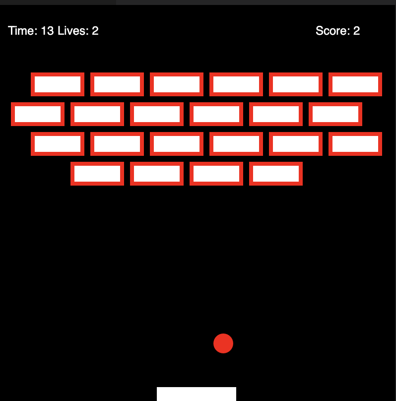
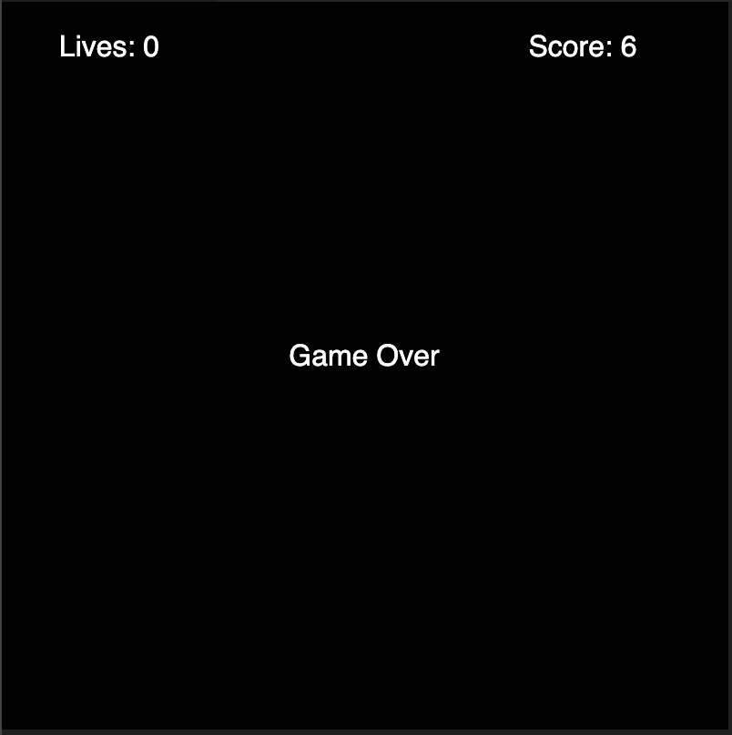

# Brick-game-js

<h2> Run the Code in VS-code </h2>
Step-1: Download Extension - live-p5  
Step-2: Open Command-Palette in your JS code 
Step-3: Search for "open live p5 panel" 
 

<h2>Game Window</h2>

